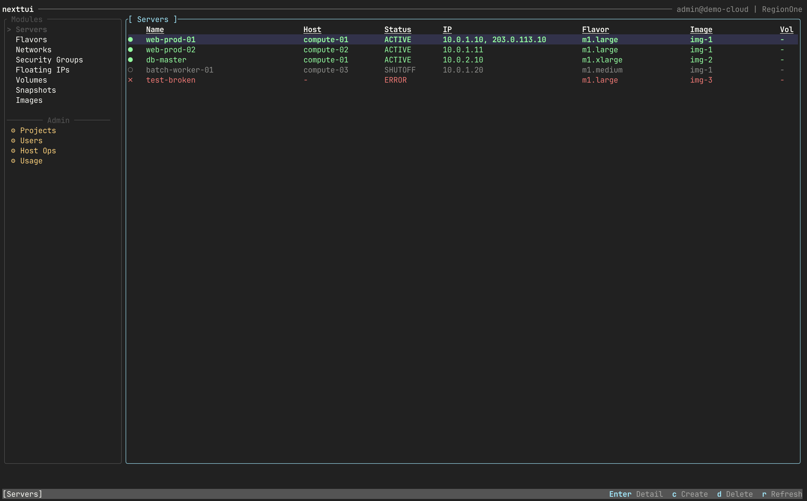
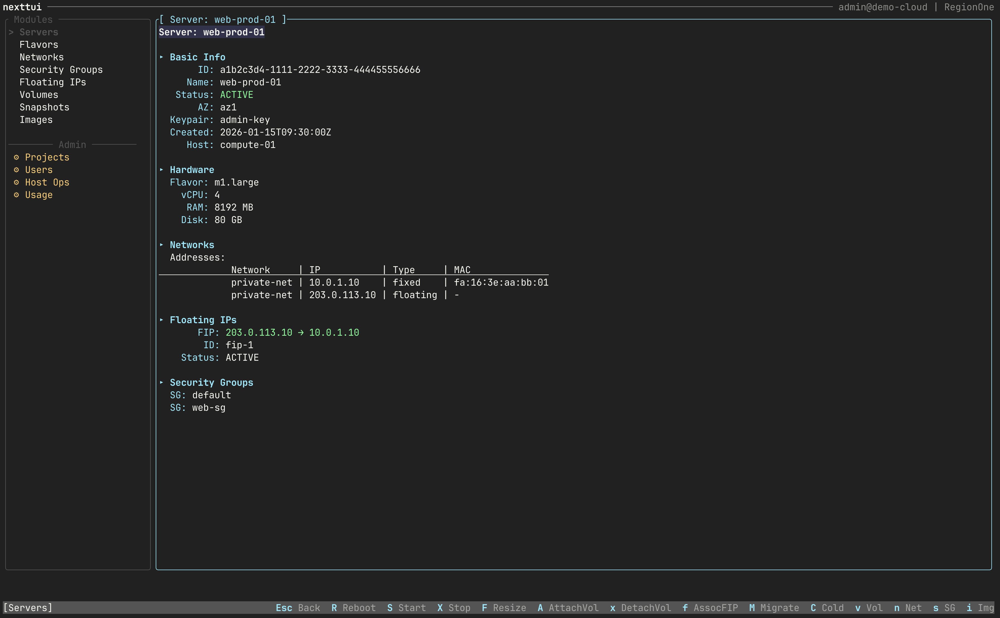
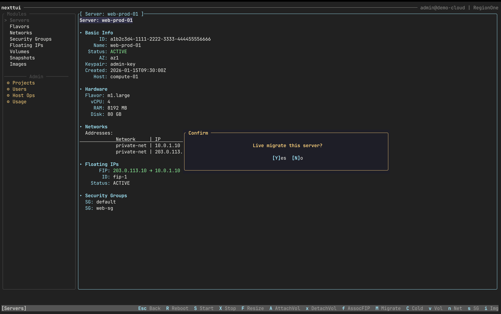
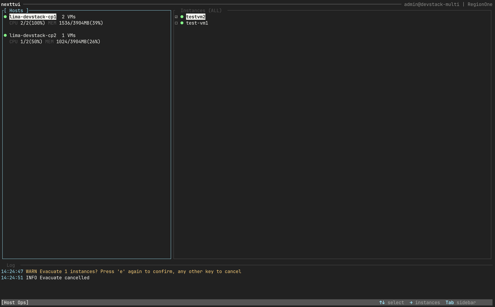
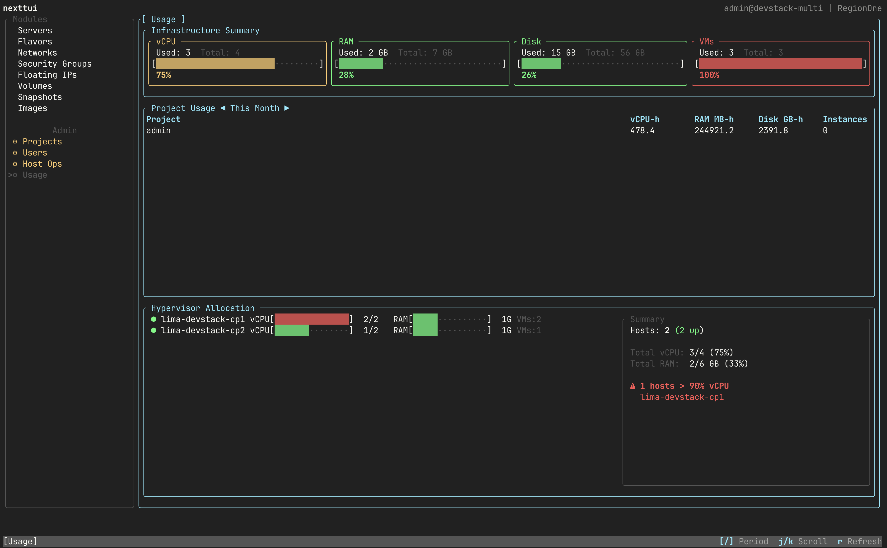

# nexttui

🇰🇷 **한국어** | [🇺🇸 English](README.en.md)

[](https://opensource.org/licenses/MIT)
[](https://www.rust-lang.org/)
[](https://ratatui.rs)

OpenStack 클라우드 관리를 위한 터미널 UI (TUI). Rust + [ratatui](https://ratatui.rs) 기반.

퍼블릭 클라우드 **인프라 운영자**가 서버, 네트워크, 볼륨, Floating IP 등 OpenStack 리소스를 터미널에서 빠르게 조회하고 관리할 수 있는 Admin TUI 도구입니다.

## 스크린샷

### Server List View


### Server Detail View


### Server Live Migrate


### Host Operations


### Usage Monitoring


## 주요 기능

### 리소스 조회/관리
- **17개 도메인 모듈**: Servers, Flavors, Networks, Security Groups, Floating IPs, Volumes, Snapshots, Images, Projects, Users, Aggregates, Compute Services, Hypervisors, Network Agents, Host Operations, Migration, Usage
- **생성/삭제 폼**: 필수 필드(`*`) 검증, 확인 다이얼로그, Toast 알림
- **계층 네비게이션**: Sidebar ↔ List ↔ Detail, 일관된 방향키 흐름

### 운영 액션
- **Volume Attach/Detach**: 양방향 진입 (볼륨 → 서버 선택 / 서버 → 볼륨 선택)
- **FloatingIP Associate/Disassociate**: 포트 자동 선택, 서비스 중단 경고
- **Force Detach / State Reset**: Admin 전용, TypeToConfirm 안전장치
- **Server Resize / Migration / Evacuate**: 호스트 장애 대응 워크플로우
- **위험도 등급별 확인**: Y/N (일반) → TypeToConfirm (위험) → 이름 입력 (고위험)

### 대시보드 & 모니터링
- **Usage Module**: btop 스타일 사용량 대시보드 (Infrastructure Summary + Project Usage + Hypervisor Allocation)
- **게이지 바**: 임계치 색상 (Green 0~70% / Yellow 71~90% / Red 91~100%)
- **Activity Log**: CUD 작업 이력 팝업 (`!` 키), StatusBar 에러 뱃지

### 안전장치
- **RBAC 3단계**: Reader / Member(Operator) / Admin 권한 분리
- **CrossTenantGuard**: all_tenants 모드에서 CUD 기본 차단 + break-glass (`Ctrl+T`)
- **TransitionGuard**: 전이 상태(attaching/detaching) 키 비활성화
- **부트볼륨 보호**: 비admin 거부, admin TypeToConfirm 2단계
- **감사 로그**: `~/.config/nexttui/audit.log` JSON Lines 기록 (10MB rotation)

### UI/UX
- **Theme 시스템**: 포커스 하이라이트, 상태 아이콘, Rounded 보더
- **SelectPopup 인라인 검색**: `/` 키로 서버/볼륨 목록 필터링
- **ConfirmDialog 상세 정보**: 볼륨명/크기/타입/프로젝트 등 의사결정 컨텍스트 표시
- **리소스 연결성**: 서로 연결된 리소스는 모든 화면에서 이름으로 양방향 표시
- **서버 상세 네비게이션**: `v`(Volumes) `n`(Networks) `s`(SG) `i`(Images) 점프

## 요구 사항

- Rust (edition 2024)
- OpenStack 환경 + `clouds.yaml` 설정

## 설치 및 실행

```bash
# 빌드
cargo build --release

# 실행 (clouds.yaml 필요)
cargo run -- --cloud mycloud

# Demo 모드 (API 없이)
cargo run -- --demo
```

## clouds.yaml 설정

아래 경로 중 하나에 `clouds.yaml`을 배치합니다:

1. `$OS_CLIENT_CONFIG_FILE` 환경변수
2. `./clouds.yaml` (현재 디렉토리)
3. `~/.config/openstack/clouds.yaml`
4. `/etc/openstack/clouds.yaml`

```yaml
clouds:
  mycloud:
    auth:
      auth_url: https://keystone.example.com/identity/v3
      username: admin
      password: secret
      project_name: admin
      user_domain_name: Default
      project_domain_name: Default
    region_name: RegionOne
```

## 키 바인딩

### 공통
| 키 | 동작 |
|----|------|
| `↑↓` / `j/k` | 목록 이동 |
| `Enter` / `→` | 상세 보기 / 선택 |
| `←` / `Esc` | 뒤로 |
| `Tab` | Sidebar ↔ Content 포커스 전환 |
| `1-9, 0` | Sidebar 모듈 직접 이동 |
| `c` | 생성 폼 열기 |
| `D` (Shift+D) | 삭제 |
| `r` | 새로고침 |
| `!` | Activity Log 팝업 |
| `q` | 종료 |

### Volume / Floating IP
| 키 | 동작 |
|----|------|
| `a` | Attach / Associate |
| `x` | Detach / Disassociate |
| `F` (Shift+F) | Force Detach (Admin) |
| `R` (Shift+R) | Force State Reset (Admin) |

### Server 상세
| 키 | 동작 |
|----|------|
| `A` (Shift+A) | 볼륨 Attach |
| `x` | 볼륨 Detach |
| `f` | Floating IP Associate |
| `v` / `n` / `s` / `i` | Volumes/Networks/SG/Images 모듈로 이동 |

### Usage
| 키 | 동작 |
|----|------|
| `[` / `]` | 기간 전환 (This Month / Last Month / Last 7 Days) |
| `j` / `k` | 스크롤 |
| `r` | 새로고침 |

## 아키텍처

```
src/
├── app.rs          # App 루트 (FocusPane, InputMode, AuditLogger)
├── registry.rs     # ModuleRegistry (모듈 자동 등록)
├── component.rs    # Component trait
├── worker.rs       # Background worker (Action → API → AppEvent)
├── event_loop.rs   # tokio::select (key/tick/background 이벤트)
├── adapter/        # HTTP adapters (Nova, Neutron, Cinder, Glance, Keystone)
├── port/           # Port traits (API 추상화)
├── module/         # 17개 도메인 모듈
│   ├── server/     # ServerModule + ServerViewContext
│   ├── volume/     # VolumeModule (attach/detach)
│   ├── floating_ip/# FloatingIpModule (associate/disassociate)
│   ├── host/       # HostModule (evacuate, composite 레이아웃)
│   ├── usage/      # UsageModule (btop 스타일 대시보드)
│   └── ...
├── ui/             # UI 위젯
│   ├── select_popup.rs  # SelectPopup (인라인 검색)
│   ├── confirm.rs       # ConfirmDialog (YesNo / TypeToConfirm)
│   ├── gauge_bar.rs     # GaugeBar (btop 스타일)
│   ├── toast.rs         # Toast 알림
│   └── ...
├── models/         # OpenStack API 응답 모델
└── infra/          # RBAC, Cache, Config, AuditLogger, CrossTenantGuard
```

**패턴**: Component-Based + TEA 하이브리드 (Action → Worker → AppEvent → State) + Port/Adapter + ViewContext

## 테스트

```bash
cargo test          # 1108 tests
cargo clippy        # lint
```

## 기여하기

기여를 환영합니다! Pull Request를 자유롭게 제출해주세요.

1. 레포지토리 Fork
2. Feature 브랜치 생성 (`git checkout -b feature/amazing-feature`)
3. 변경사항 커밋 (`git commit -m 'feat: add amazing feature'`)
4. 브랜치 Push (`git push origin feature/amazing-feature`)
5. Pull Request 생성

## 라이선스

이 프로젝트는 MIT 라이선스로 배포됩니다. 자세한 내용은 [LICENSE](LICENSE) 파일을 참조하세요.
