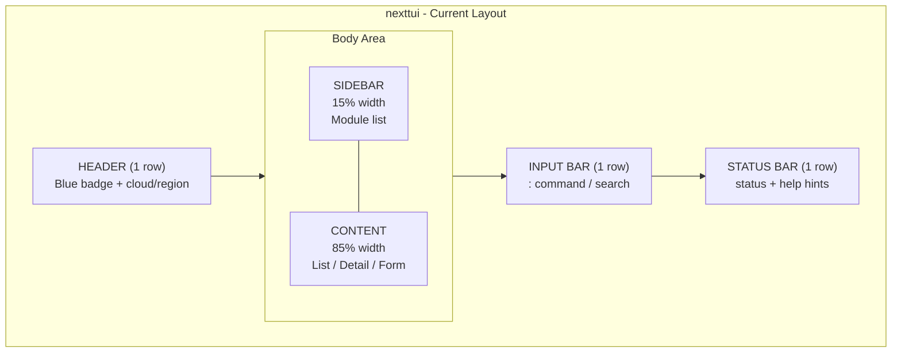
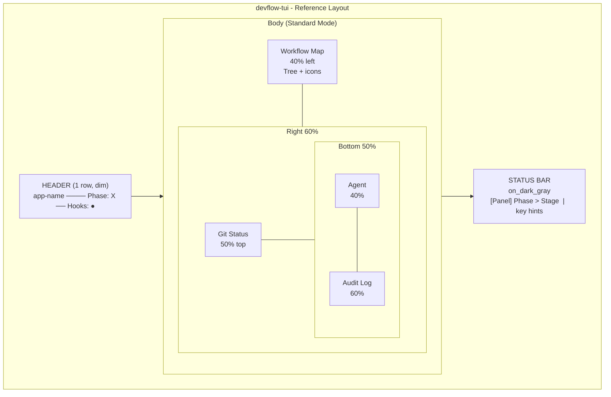
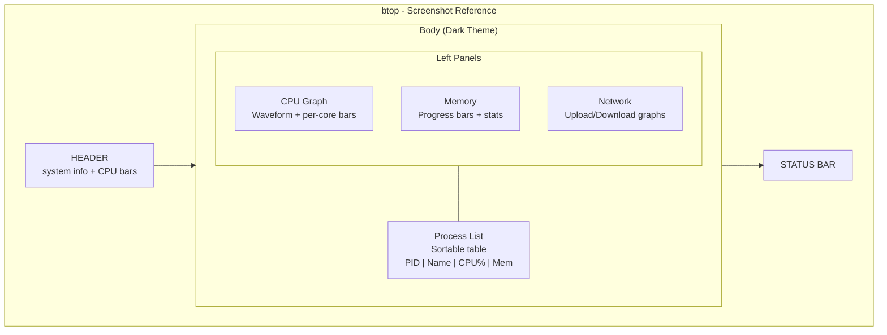
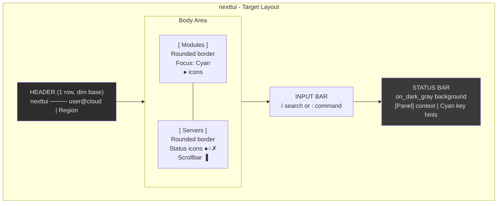
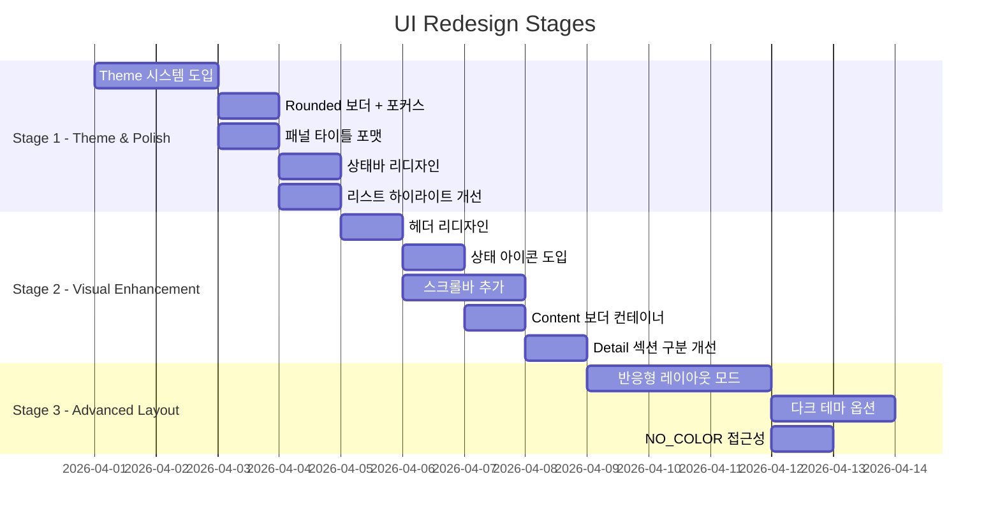

# NextTUI UI/UX Redesign Analysis

> Date: 2026-03-31
> Status: Analysis Complete, Backlog Registered
> References: devflow-tui (theme/layout), btop (screenshot), nexttui (current)

---

## 1. Executive Summary

nexttui의 현재 UI는 **기능적으로 정확**하지만 **시각적 폴리시가 부족**하다.
devflow-tui의 Theme 시스템/포커스 피드백과 btop의 다크 테마/정보 밀도를 참조하여,
3단계에 걸쳐 UI를 개선한다.

---

## 2. 현재 레이아웃 비교

### 2.1 nexttui (현재)

```
ASCII Layout:
+=========================================================+
| HEADER: [SERVER] [ALL]          [cloud | region]         |  1 row
+---------+-----------------------------------------------+
|         |                                               |
| SIDEBAR | CONTENT AREA                                  |
| (15%)   | (List View / Detail View / Form)              |
|  >Srv   |                                               |
|   Flv   |  Name       Status    ID                      |
|   Net   |  *web-01    ACTIVE    srv-123*  <- selected   |
|   Vol   |   web-02    SHUTOFF   srv-456                 |
|   Img   |   db-01     ERROR     srv-789                 |
|         |                                               |
+---------+-----------------------------------------------+
| INPUT BAR: : command  |  / search                       |  1 row
+---------------------------------------------------------+
| STATUS BAR: Servers | 1/5    j/k:Move Enter:Select      |  1 row
+=========================================================+
```



### 2.2 devflow-tui (참조)

```
ASCII Layout:
 devflow-tui ────────────── Phase: CONSTRUCTION ── Hooks: ● 9464
+---[ Workflow Map ]------+---[ Git Status ]------------------+
| INCEPTION               | Branch: feat/resize (cyan)        |
|  ├── ✓ workspace-detect | HEAD: abc1234 (dim)               |
|  ├── ✓ requirements     | +12 -3 (green/red)                |
|  └── ✓ workflow-plan    +-----------------------------------+
| CONSTRUCTION            | [ Agent Status ]|[ Audit Log     ]|
|  ├── ● unit-1 (active)  | ● Explore  5s  | 14:20 stg → B   |
|  ├── ○ unit-2           | ✓ Plan    done  | 14:25 stg → Skip|
|  └── ○ unit-3           | ⏱ Review  t/o  |                  |
+-------------------------+-----------------+------------------+
 [Workflow Map]  CONSTRUCTION > unit-1    Tab 패널  j/k 스크롤  q 종료
```



### 2.3 btop (스크린샷 참조)

```
ASCII Layout:
 btop ═══════════════════ BATM 105% ████████████ 2000Mhz
+--[ CPU ]----------------+--[ Proc ]--------------------+
| ▁▃▅▇█▇▅▃▁▃▅▇ (waveform)| PID  Program     CPU%  Mem   |
| ████████ 78%  C0        | 1234 chrome      12.3  450M  |
| ██████   55%  C1        | 5678 code         8.1  1.2G  |
| ████     33%  C2        | 9012 node         4.5  200M  |
+-------------------------+------------------------------+
+--[ Mem ]--+--[ Disk ]---+                               |
| Used 17GB | /    45%    |                               |
| ████████  | /home 78%  |                               |
| Free 8GB  |             |                               |
+--[ Net ]--+-------------+------------------------------+
| ▁▂▃▄ Download           |                               |
| ▄▃▂▁ Upload              |                               |
+-------------------------+------------------------------+
```



---

## 3. 상세 비교 매트릭스

| 디자인 요소 | nexttui (현재) | devflow-tui | btop |
|---|---|---|---|
| **테마 시스템** | 색상 하드코딩 | `Theme` 구조체 + NO_COLOR | 다크 테마 고정 |
| **보더 스타일** | Sidebar만 Right border | Rounded, 모든 패널 | Rounded, 모든 패널 |
| **보더 포커스** | Cyan/DarkGray (sidebar만) | Cyan/DarkGray (전체) | 밝기 변화 |
| **패널 타이틀** | 단순 텍스트 | `[ Title ]` / `  Title  ` | 보더에 통합 |
| **헤더** | Blue 뱃지 bg + cloud/region | Dim + `─` 채움 + Phase/Hooks | 시스템 정보 바 |
| **상태바 배경** | 없음 (투명) | `on_dark_gray().white()` | 있음 |
| **상태바 힌트** | key=Cyan + label=Gray | key=Cyan Bold + desc=Dim | 최소 |
| **리스트 선택** | Black on White | White Bold | 하이라이트 행 |
| **시맨틱 컬러** | 개별 지정 | Theme::active/done/error | Green/Pink/Purple |
| **상태 아이콘** | 텍스트만 | `●✓○–✗⏱` | 그래프 + 바 |
| **스크롤바** | 없음 | 수직 (block chars) | 있음 |
| **반응형** | 고정 15% sidebar | 4단계 모드 | 반응형 |
| **접근성** | 없음 | NO_COLOR 지원 | 컬러 맵핑 |
| **섹션 구분** | `-- Section --` (ASCII) | Block border + title | Panel border |

---

## 4. nexttui 현재 UI 강점/약점

### 4.1 강점
- **시맨틱 색상**: Green=Active, Red=Error, Yellow=Warning 직관적
- **Toast 알림**: `[OK]`/`[ERR]`/`[i]` 텍스트 접두사로 색상 외 추가 식별 가능
- **헤더 뱃지**: Blue 배경 리소스 타입 + Yellow ALL 뱃지 명확
- **Sidebar 마커**: `>` 현재 위치 표시 간결
- **Detail 정렬**: Key-Value 우측 정렬 깔끔

### 4.2 약점
- **선택 행 시맨틱 손실**: Black on White로 Active/Error 색상 사라짐
- **보더 부재**: Content 영역에 시각적 컨테이너 없음 (텍스트가 떠다니는 느낌)
- **Header/Body/Footer 구분 약함**: 색상 변화만으로 영역 구분
- **스크롤바 없음**: 더 많은 데이터 존재 여부 알 수 없음
- **상태바 힌트 가독성**: Gray 텍스트 낮은 대비
- **Detail 섹션 구분**: `-- Section --` 대시 구분자 올드 스타일
- **포커스 피드백 부족**: Content 영역에 포커스 상태 시각 표현 없음
- **상태 아이콘 없음**: 텍스트 "ACTIVE"/"ERROR"만 표시

---

## 5. 개선 제안: 목표 레이아웃

### 5.1 개선된 레이아웃 (목표)

```
ASCII Layout (Target):
 nexttui ─────────────────────────── admin@devstack | RegionOne
+--[ Modules ]--+--[ Servers ]------------------------------------+
| > Servers     | Name        Status     Flavor    AZ    Created  |
|   Flavors     | web-01      ● ACTIVE   m1.small  az1   2h ago   |
|   Networks    | web-02      ○ SHUTOFF  m1.tiny   az1   1d ago   |
|   Volumes     | db-01       ✗ ERROR    m1.large  az2   3d ago   |
|   Images      |                                                  |
|   SecGroups   |                                                  |
|   FloatIPs    |                                                  |
|   Projects    |                                                  |
|   Users       |                                                  |
|               |                                          ▐ 1/3  |
+---------------+--------------------------------------------------+
| / search_term_                                                   |
+------------------------------------------------------------------+
 [Servers] 1/3         Tab 패널  j/k 이동  Enter 상세  c 생성  q 종료
```



### 5.2 Detail View (목표)

```
ASCII Detail View (Target):
 nexttui ─────────────────────────── admin@devstack | RegionOne
+--[ Modules ]--+--[ Server: web-01 ]-----------------------------+
| > Servers     | Basic Info                                       |
|   Flavors     |   ID         srv-12345-abcd-6789                 |
|   Networks    |   Status     ● ACTIVE                            |
|   Volumes     |   Flavor     m1.small (1 vCPU, 512MB, 1GB)      |
|   Images      |   AZ         nova                                |
|               |   Created    2026-03-30 14:20:00                 |
|               |                                                  |
|               | Network                                          |
|               |   eth0       192.168.1.10                        |
|               |   eth1       10.0.0.5                            |
|               |                                                  |
|               | Links                                            |
|               |   Image      Ubuntu 22.04 (cyan, underline)      |
|               |   Network    private-net (cyan, underline)       |
+---------------+--------------------------------------------------+
 [Server Detail] Esc 목록  Tab 링크  r Resize  d 삭제  s 스냅샷
```

---

## 6. 디자인 토큰 (Theme 시스템)

devflow-tui + btop 참조로 nexttui에 도입할 Theme 토큰:

```
Token Name        Color          Usage                     NO_COLOR
─────────────────────────────────────────────────────────────────────
active            Yellow Bold    실행 중 / 전이 상태        Bold
done / success    Green          정상 / 완료                Default
waiting           DarkGray       대기 / 비활성              Dim
error             Red            에러 / 장애                Bold
warning           Yellow         경고                       Bold
focus_border      Cyan           포커스된 패널 보더         Bold
unfocus_border    DarkGray       비포커스 패널 보더         Dim
highlight         White Bold     선택된 행 (시맨틱 유지)    Bold
timestamp         Cyan           시간 정보                  Default
disabled          DarkGray Dim   비활성 메뉴 / admin 전용   Dim
link              Cyan Underline 리소스 링크                Underline
```

상태 아이콘:

```
Icon    Status          Color
────────────────────────────
●       ACTIVE          Green
○       SHUTOFF         DarkGray
✗       ERROR           Red
⟳       BUILD/RESIZE    Yellow
◐       VERIFY_RESIZE   Yellow
↔       MIGRATING       Cyan
!       PAUSED          Yellow
```

---

## 7. 단계별 구현 로드맵



```
ASCII Gantt (Implementation Stages):

Stage 1: Theme & Polish (즉시, High Impact)
  ├── BL-P2-034: Theme 시스템 도입
  ├── BL-P2-035: Rounded 보더 + 포커스 피드백
  ├── BL-P2-036: 패널 타이틀 포맷 (bracket/space)
  ├── BL-P2-037: 상태바 리디자인 (dark_gray bg + key hints)
  └── BL-P2-038: 리스트 하이라이트 개선 (White Bold, 시맨틱 유지)

Stage 2: Visual Enhancement (중기)
  ├── BL-P2-039: 헤더 리디자인 (dim + fill line + context)
  ├── BL-P2-040: 상태 아이콘 도입 (●○✗⟳)
  ├── BL-P2-041: 스크롤바 추가 (리스트/디테일)
  ├── BL-P2-042: Content 보더 컨테이너
  └── BL-P2-043: Detail 섹션 구분 개선 (Block title)

Stage 3: Advanced Layout (장기)
  ├── BL-P2-044: 반응형 레이아웃 모드 (Compact/Standard/Wide)
  ├── BL-P2-045: 다크 테마 옵션
  └── BL-P2-046: NO_COLOR 접근성 지원
```

---

## 8. 참조 소스

| 소스 | 경로 | 참조 요소 |
|------|------|----------|
| devflow-tui Theme | `~/projects/backend/devflow-tui/src/ui/theme.rs` | Theme 구조체, panel_title, key_hint, Icons |
| devflow-tui Layout | `~/projects/backend/devflow-tui/src/ui/layout.rs` | LayoutMode, responsive panels, centered_rect |
| devflow-tui Status Bar | `~/projects/backend/devflow-tui/src/ui/status_bar.rs` | on_dark_gray, key hints 패턴 |
| devflow-tui Header | `~/projects/backend/devflow-tui/src/ui/header.rs` | Dim base, fill line, Phase/Hooks |
| btop Screenshot | `devflow-docs/Screenshot1.png` | Dark theme, rounded borders, progress bars, icons |
| nexttui UI | `src/ui/` | 현재 구현 전체 |
